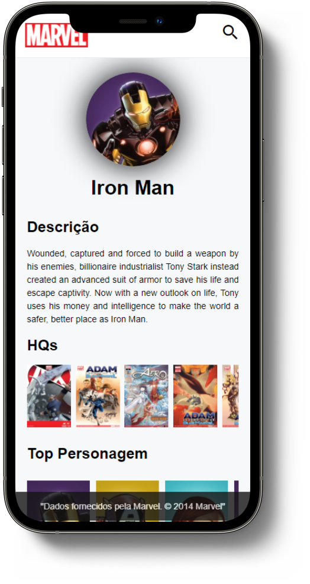

# Herocast

## Mobile

## 🚀 Tecnologias utilizadas

O projeto foi desenvolvido utilizando as seguintes tecnologias:

- HTML
- CSS
- JavaScript

## 💻 Projeto

o Herocard é um projeto desenvolvido utilizando a Api da marvel podendo consultar todos os personagens da marvel pela barra de pesquisas ou pelos personagens ja sugeridos.

## 🔖 site

Você pode visualizar o projeto finalizado [nesse link](https://herocast.vercel.app/). Você pode utilizar os serviços a vontade 

